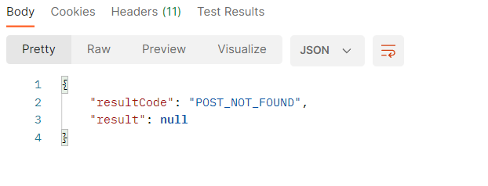

# SNS 
## Flow Chart

1. 회원가입

2. 로그인

3. 포스트 작성

4. 포스트 삭제

5. 포스트 수정

6. 피드 목록

## Result

1. 회원가입

2. 로그인

- 로그인 시 인증 토큰 생성

3. 게시물 등록

- 인증 토큰 header로 전달

- 토큰 일치하지 않을 경우
  

- 게시물 등록 성공

4. 게시물 수정

- 해당 포스트가 없는 경우

- 인증 토큰이 일치하지 않을 경우

- 게시물 수정 성공

5. 게시물 삭제
- 삭제 성공

6. 게시물 목록 조회
- 전체 글 목록

- 나의 목록

